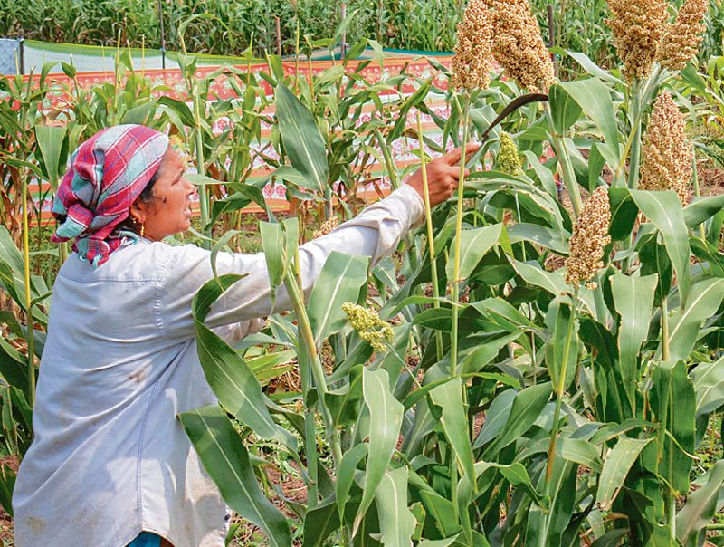
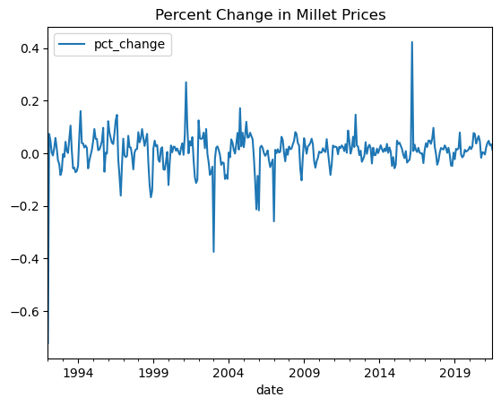
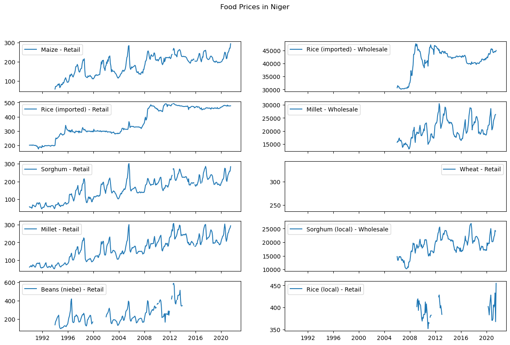
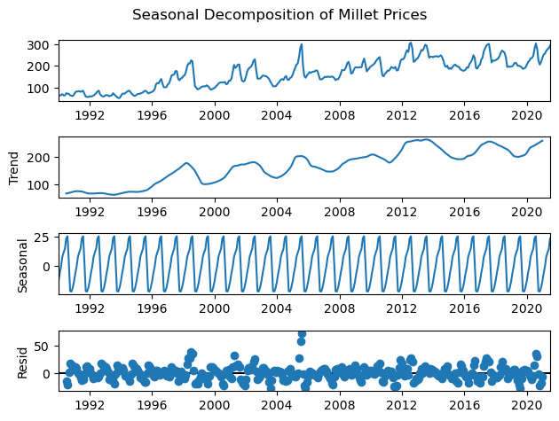
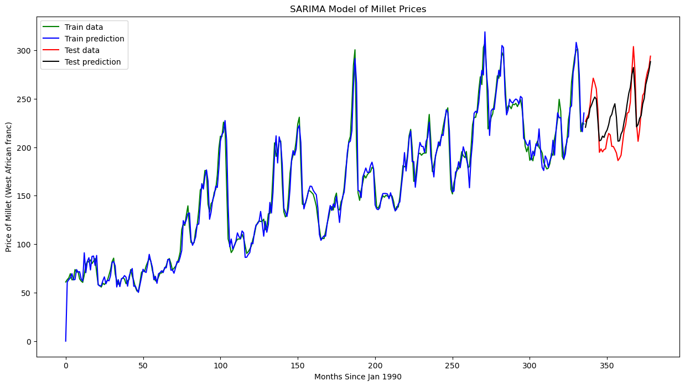
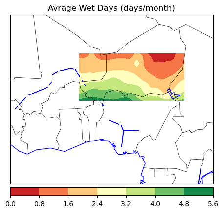
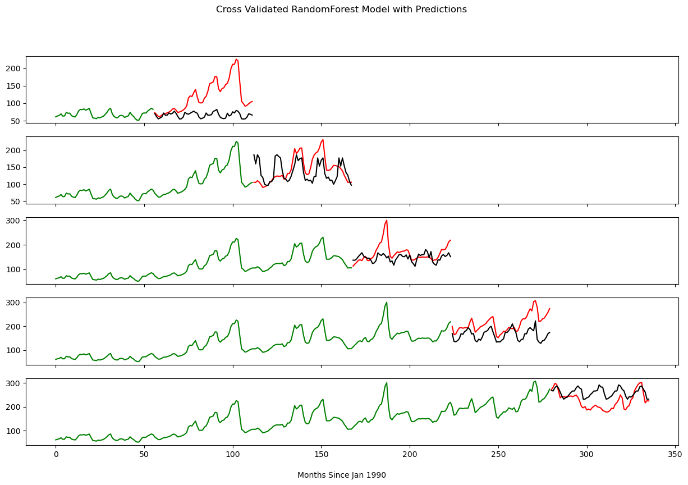

# Predicting Food Prices in Developing Countries

## Overview
In this project, I took historical food price data from developing countries and used **time series analysis** in order to predict what the prices would be up to two years in the future. Throughout the project I dealt with strong **seasonality** in the dataset, explored both **regression** and **ARIMA** based models, and incorporated historical **climate data** in order to improve my results. My final model was able to achieve mean absolute percentage error scores of around 12 % on the test set, and was robust when cross-validated, but had difficulty predicting for extreme events.

## Buisness Case
Food insecurity is a massive global issue that affects over [345 million people worldwide in 2023](https://www.wfp.org/global-hunger-crisis), with more than 900,000 of those suffering in famine-like conditions. These problems can be especially acute in sub-saharan africa and the middle-east, where conflict disrupts the local food supply and climate change makes previously productive land more marginal. The ability to predict the local price of food months or years in advance would be of great value to international aid groups trying to alleviate this issue, and would allow them to better allocate resources to where they are needed most.

## Data Sources
https://www.kaggle.com/datasets/lasaljaywardena/global-food-prices-dataset

https://ceda-wps-ui.ceda.ac.uk/

## Data Wrangling
[This notebook](Notebooks/Data_Wrangling.ipynb) involved loading in the general food price data, which was in a very condensed format where each row was a combination of country, state, market, name of the good, its price, and the date, which was converted to datetime format. In order to focus the analysis and get a single time series to work with I chose Niger as a specific country to focus on. Niger had the longest time series in the dataset, and included goods that were found in several other countries such as milllet. I wanted to compare the price of a good across several different countries, but the prices for each were listed in the local currency, making direct comparison impossible. Instead, I **averaged the percent change in price** for that good across that timeframe, and saved that as a seperate dataframe. 

## Exploratory Data Analysis
In the first part of [this notebook](Notebooks/EDA.ipynb) I selected all of the data from Niger then "unpivoted" the goods data from into seperate columns and averaged the prices across all of the markets, creating a dataframe where each row was one unique date and each good had its own column. These goods were then graphed to see overall trends and determine what good should be studied.

Due to its completeness (and because several other countries had millet data) millet prices were chosen as the target feature, and any NaN values were **interpolated** in order to make the dataset complete. Additionally, the **seasonal decomposition**, **autocorrelation**, and **partial autocorrelation** were plotted for the millet price data in order to see the components that made up the time series, and get an idea of how an ARIMA model might be made from the data.

## Preprocessing and Training
[The first exploration of modeling](Notebooks/Preprocessing_and_Training.ipynb) involved two strategies. The first was using sk-learn's **linear regression**, with months and years broken up into their own features. This produced a decent model (mean absolute percentage errors or mape of ~15%) but failed to predict historical spikes and dips in the data, and adding worldwide millet price data made the model worse, not better. 

The second strategy was to try an **ARIMA** approach. ARIMA, or an autoregressive integrated moving average model, is fundimentally about using previous data points in a time series to predict future values, and an introduction to its concepts can be found [here](https://en.wikipedia.org/wiki/Autoregressive_integrated_moving_average). A basic ARIMA model takes no features other than the price and the time, and in order to practice these concepts I chose to try and find the p, d, and q parameters of the ARIMA model myself. After finding the autocorrelation and partial autocorrelation of the differenced series a (2,1,1) ARIMA model was chosen, but it failed to make any good predictions. 

A basic ARIMA model does not work well with seasonality, and clearly changes in the price of food can be very seasonal! In order to correct this a seasonal ARIMA or SARIMA model was neaded. I used pmdarima's **auto_arima** function to find the optimal parameters for the SARIMA model, and it produced a very accurate model with a **mean absolute percentage error of 6.4%**. However, cross-validating the model showed that the model was brittle, and either performed worse or made wildly inaccurate predictions on some folds.

## Final Modeling
[The final part of the project](Notebooks/Final_Modeling.ipynb) involved adding external data to improve the models, as well as making them more robust. I chose to use historical climate data from the [Centre for Enviornmental Data Analysis](https://ceda-wps-ui.ceda.ac.uk/) in order to improve my predictions, specifically **temperature and precipitation data** for Niger over the time period I was studying. This came in the form of a netCDF file, which contained coordinate based climate data that I averaged across the whole country and converted into a dataframe that could be combined into my time series.

Normally a SARIMA model cannot handle external (exogenous) variables, but a variant called a SARIMAX model can. Repeating the process from the previous notebook created a model that performed (very) slightly better on the test set, but again failed dramatically on cross-validation. I chose to try simple regression techniques again, and tested sklearn's **LinearRegressor** and **RandomForestRegressor** on the dataset with cross-validation and a **grid search** for hyperparameter tuning. I found that a random forest model produced the best results. While it performed somewhat worse on the test set (mape ~12%), it was much more robust on cross-validation, and produced reasonable results even when less data was given to the model. 

Finally, I repeated the entire above process on a different country, **Afghanistan**, in order to see how well the random forest approach performed on a country with a very different history and climate. The results were still robust, with a mape on the test set of 6.5% and decent results on cross validation, but again large jumps in prices were still not predicted for. 

## Conclusion and Next Steps
While a SARIMA model was able to achieve the lowest mean absolute percentage error on the test set, a random forest regressor was shown to be the best choice overall, and was able to give reasonable predictions even with smaller samples of data. This is important because NGOs or other organizations are not likely to have vast amounts of historical price data for many countries, so choosing a more robust model seems prudent. Choice of good is also important to consider, as the price of (locally grown) Niger millet was much more seasonal and variable than the (mostly imported) Afghani wheat. However, none of the models predicted the occasional large spikes in price that occured in both Niger and Afghanistan, even with climate data added to the model. 

The next steps for this model would likely revolve around better predicting these unusual spikes, as they can represent real suffering and even famine in these countries when they occur. Climate data alone is not enough, but did result in some improvement, so other features should be incorporated that might capture some of the reasons these events happen. This could include a time series of sentiment analysis on twitter or other social media, that might inform the model about levels of violence or other extreme events in those countries. A dataset on insect and pest populations could also be highly predictive in countries that mostly grow their own food, but would involve working closely with local researchers and would still be likely very difficult to get.